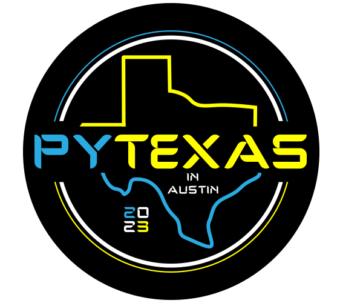

<!-- _backgroundImage: linear-gradient(to bottom,rgba(0, 0, 0, 0.6),rgba(0, 0, 0, 0.8)), url(./images/background.jpg); -->

# **A Build Engineer in a buildless lang**

## Joshua Cannon

---

<!-- paginate: true -->

# Who am I?

# What is BuildEng/DevX?

# Why care?

<!--
- Two halves to presentation:
  1. Answer these three questions
  1. Open my toolbox

- At a high level, here's the answers

-->

---

## Who am I?

Joshua Cannon | Build Engineer | IBM Watson Orders

# What is BuildEng/DevX?

# Why care?

---

## Who am I?

Joshua Cannon | Build Engineer | IBM Watson Orders

## What is BuildEng/DevX?

It's the tools/processes for the people building the code.​
And how intuitive/cohesive they are(n't).​

# Why care?

<!--
- Not about the build process for the code
  - Tools
  - Workflows
  - Environment
- Seams
- Build Eng -> DevX
- Build Engineering can come from anyone
-->

---

## Who am I?

Joshua Cannon | Build Engineer | IBM Watson Orders

## What is BuildEng/DevX?

It's the tools/processes for the people building the code.​
And how intuitive/cohesive they are(n't).​

## Why care?

Every developer has a "developer experience".​​
Good or bad.

<!--
- How you're feeling when you have to develop software. Good or bad

Color -> Telling a story

My career, how I became a BuildEng, and what I do as a build eng, and why
-->

---

<!-- _backgroundImage: url(./images/typewriter.jpg) -->

<!--
- Last company. Extremely sophisticated build system to build code. Multiple platforms, debug/release etc...
- All it did
- Code review
- How many have had the same experience?
- How many of you think there's a better way to do this
- Coding on a typewriter

I found more love for Build Engineering
-->

---

<!-- _backgroundImage: url(./images/fight-fire.jpg) -->

<!--
- I got a manager that understood Build Engineering can come from anyone
- In my 20% time, I started doing Build Engineering

Minimized Seams:
- Moved code into monorepo
  - Pros:
    - visibility and collaboration
    - Large scale atomic changes/refactoring
  - Cons:
   - Need sophisticated tools
- make -> poetry
- black: 2 reasons
  - Opinionated
    - Bonus points: reduces diff
  - De-facto standard community

More tools:
- Started using flake8 to lint, advocated for mypy and pytest

Reaching the People:
- Started a Python Working Group, so it was the opinion of many
- Gave presentations

- It wasn't enough for me, although build eng comes from anyone I wanted ot be a build engineer

company that valued build engineering
-->

---

<!-- _backgroundImage: linear-gradient(to bottom,rgba(0, 0, 0, 0.1),rgba(0, 0, 0, 0.3)), url(./images/working.jpg) -->

<!--
Start looking where you can improve things

- Devx, better but still bad
- Using tools: yapf, pylint + in-house AST linting, mypy, unittest
- Build system - Bazel: held them back more than boosted them forward
  - And sometimes running your tests would take several minutes, test flakiness
- Odds and ends:
- Couldn't easily attach a debugger
- Sometimes when switching a branch, your next command would take 4 minutes
- An interruption is stomachable is I can get coffee and come back Otherwise, I've lost my momentum

-->

---

<!-- _backgroundImage: linear-gradient(to bottom,rgba(0, 0, 0, 0.1),rgba(0, 0, 0, 0.2)), url(./images/breezes.jpg) -->

<!--
(Aside from build system, central integration point), there's no one big change to make it better.
Lift by a thousand breezes (opposite of death by a thousand paper cuts)

- Switched from yapf to black (also black faster)
- switched from in-house AST linting to flake8 (turns out plugins had us covered)
- starting leveraging pytest (with plugins)
- Made it simple to build any file into a docker image
- Most importantly I changed our build system from Bazel to Pants
  - Both are open source large-scale, sophisticated build tools primed for monorepos
  - Pants fit better, pun intended
  - Along the journey, upstreamed changes and bugfixes, found a welcoming and compassionate
  - Eventually became "contributor" and finally a "maintainer"
  - Means two things:
    - I get to help engineers at any org using Pants
    - I get to fight for my engineers when it comes to decisions

-->

---

<!-- _backgroundImage: linear-gradient(to bottom,rgba(0, 0, 0, 0.1),rgba(0, 0, 0, 0.2)), url(./images/fruit.jpg) -->

<!--
Fruits of my labor?

Seams:
- CI went from 18 minutes down to <5, with plans on making that ~2
  - Running all of our fixers, static analysis, running the entire monorepo of tests
- Easy for people to contribute new code to the codebase regardless of expertise
  - fearlessly

Tools
- Plethora of tools developers run locally to make sure any issues that can be found my machines is
  - and automatically fixed as well

People:
- Biweekly presentations/discussions on changes being made
  - tutorials on new build system, etc...
- Slack channels people can go for help, or dump ideas

Ultimately: developer experience

(In making these slides, I reflected on Build Engineering, and came up with a few themes)
-->

---

<!-- _backgroundImage: linear-gradient(to bottom,rgba(0, 0, 0, 0.6),rgba(0, 0, 0, 0.8)), url(./images/background.jpg); -->

# Themes of Build Engineering

<!-- prettier-ignore -->
* Responsibility / Ownership
* Tooling + Automation
  * Curiosity
* Empathetic
  * Communicative
  * Helps Others

<!--

Responsibility:
- You tend to care about something more when you are responsible for it
  - That includes the tools/processes
  - but also includes the people -> "my engineers"

Tooling and Automation:
- Reduces & eliminates "the human factor"
  - Humans take time and money
  - Emotions in human interactions
- Curioisty: whats out there? Is it better than what we have? What is the community doing?

Empathetic:
- We can all be more empathetic
  - Not everyone has the bandwidth or emotional energy to complain
  - Not everyone is a build engineer
  - Support: Curse of Knowledge
-->

---

## Who am I?

## What is BuildEng/DevX?

## Why care?

<!--
And its not just me and my engineers. Its you too. I want you to have a good experience.
-->

---

<!-- _backgroundImage: linear-gradient(to bottom,rgba(0, 0, 0, 0.1),rgba(0, 0, 0, 0.2)), url(./images/tools.jpg) -->

<!--

So here's my toolbox laid bare. Tools for a buildless language that make building code enjoyable

It's subjective, it fits my organization's needs

-->

---

<!-- @TODO: last is arrow -->

<!-- prettier-ignore -->
* Testing
  * `pytest`
    - Lots of plugins
  * Code Coverage

<!-- prettier-ignore -->
* Static Analysis
  * `mypy`
  * `pylint` 
  * `flake8`
  * (soon `ruff`)

<!-- prettier-ignore -->
* Fixers
  * `black`
  * `isort`
  * `pyupgrade`
  * `autoflake`
  * `docformatter`
  * *`preamble`
  * (soon `ruff`)

<!--

Goes from most work to least work, but all are tools that have the machines find issues, not people

Testing:
- pytest
  - Testing is not easy, so do whatever you can to make it easier
  - Code Coverage: What gets measured gets better.

Static Analysis:
- mypy: defacto standard for typechecking, helps catches bugs
- pylint: like mypy, but doesn't rely on type annotations (talk tomorrow)
- flake8: fast, does a decent job at a lot of issues that can be detected from tokens/AST
- soon ruff: Its just flake8 plus more, but faster and with more fixes

Fixers:
( I love fixers)
- black (talked about)
- isort: It's helpful
- pyupgrade: Want to be looking at code that's "modern"
- autoflake: Dead code can be detracting/harmful
- docformatter: Consistency makes reading docstrings easier
- (preamble): Stamp copyright headers
- (soon ruff): again, fixing is great, fixing very fast is better

You can run all these tools, and in a monorepo you're probably looking at at least double-digit minutes,
not including tests. You NEED a build system that gives you the ability and flexibility to run all these
without the overhead and baggage.

-->

---

<!-- _backgroundImage: linear-gradient(to bottom,rgba(0, 0, 0, 0.6),rgba(0, 0, 0, 0.8)), url(./images/background.jpg); -->

# Pants 

<!-- TODO: Demo of running tools -->

<!-- prettier-ignore -->
* Runs all our tools/code with one UI (CLI)
  - `./pants --changed-since=main fix`
  - `./pants transitive check test`
  - `./pants run path/to/myfile.py`
* Fine-grained Dependency Inference
* Incremental
* __Extreme__ caching
* Pluggable
* Cross-language

<!--

Open source build tool

- `--changed-since=master` -> Only runs on the files that have changed since master
- `run myfile.py` -> Don't see is activating a virtualenv, downloading large binary blobs artifacts from S3, running codegen

Incremental:
- Incremental in work done (--changed-since)
- Incrementally fetches dependencys (from a lockfile)

Caching:
- Local cache of all work done. Nobody does the same work twice. Especially crucial in CI
- Ability to plug into a remote cache

Pluggable: This is Python...
- Allows me to have features that are only relevant to my org
- Allows me to upstream changes, to help everyone and solve "hit by a bus"

Dependencies:
- Part of what makes pants incremental
- I can easily see what goes into our applications/docker images
- How many consumers of a file there are

-->

---

# Conclusion

<!-- prettier-ignore -->
* Build Engineering has a multiplier effect (positive or negative)
* Invest in tools and automation
* Minimize seams, make workflows cohesive
* Have empathy

<!--
- These aren't just BuildEng takeaways, these can be for anyone.

multiplier:
- investment can increase productivity and happiness
- not investing can, at best be neutral, or at worst be negative

Tools/Automation: Reduce the human factor

Minimize seams: reduce interuptions, let people do what they do best

Have empathy: It's so important. PEOPLE build code.
Software engineering is a SOCIAL activity.

-->

---

# Contact

- Pants Slack: https://pantsbuild.slack.com (@thejcannon)
- Discord: thejcannon#4100
- Email: joshdcannon@gmail.com

---

# Questions
